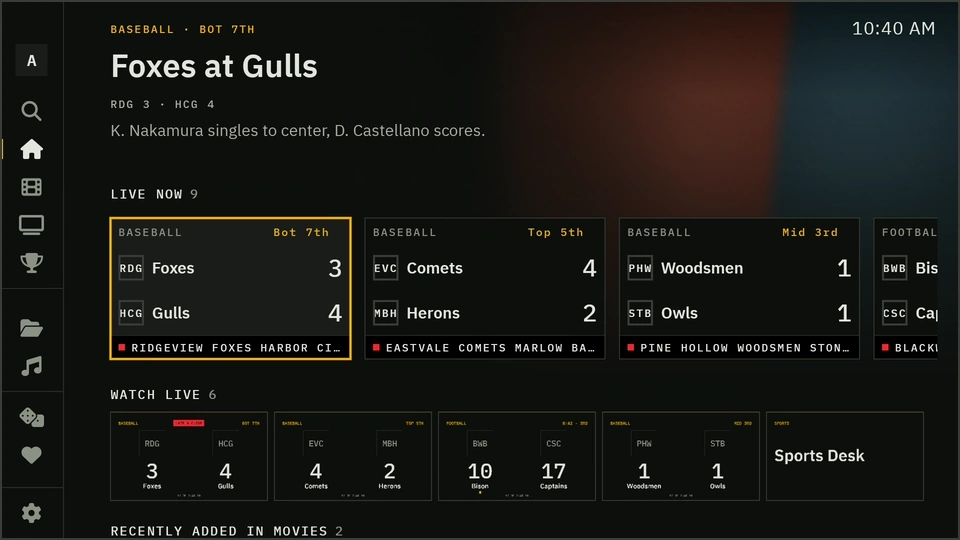
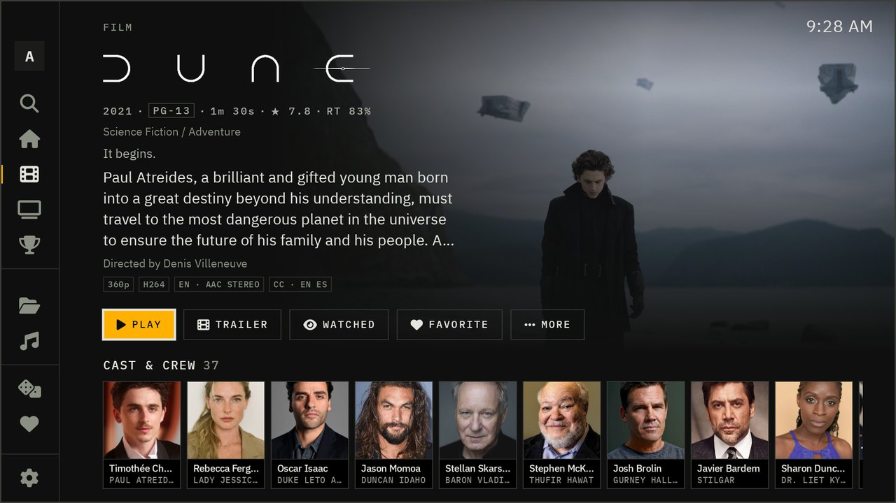
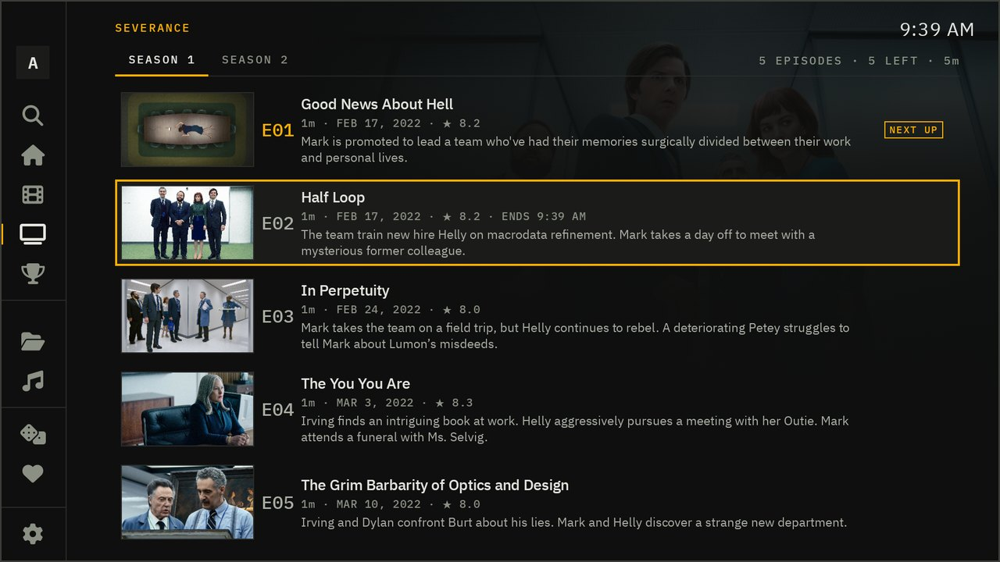
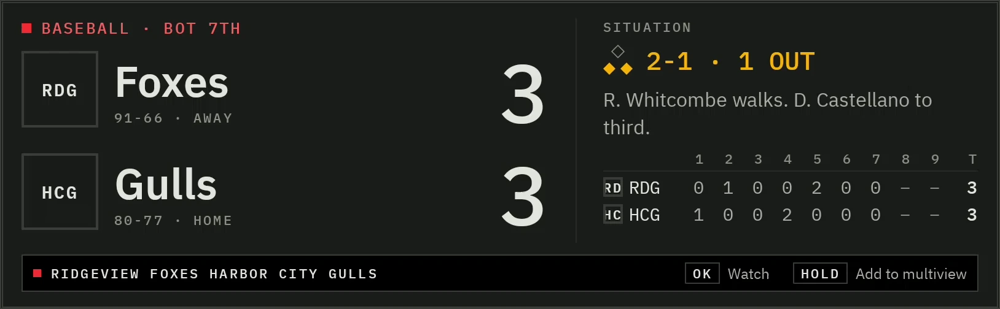
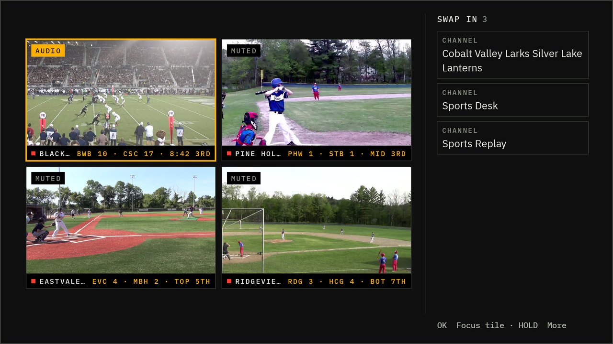
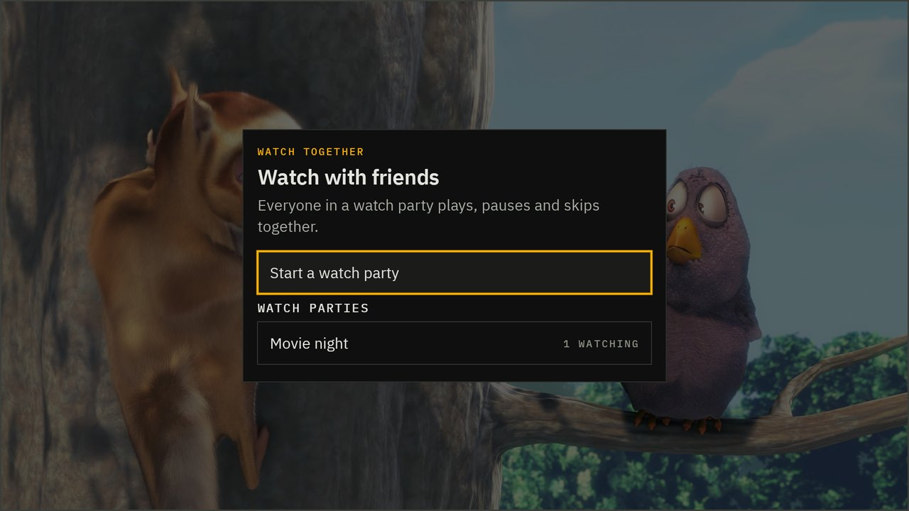
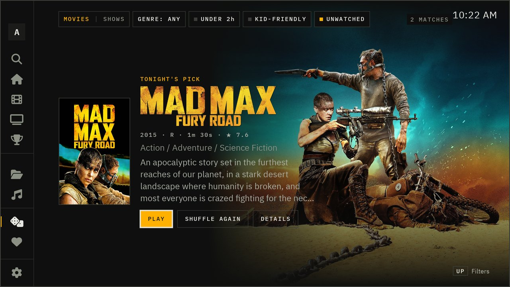

<p align="center"></p>

<p align="center">
  <a href="https://github.com/Scdouglas1999/Tally/releases/latest/download/Tally.apk"></a>
  <a href="#install"></a>
  <a href="https://github.com/Scdouglas1999/Tally/releases/latest"></a>
</p>

<p align="center"></p>

## Why it looks like this

Tally is a Jellyfin app for Android TV. It plays your films, shows and music, and tonight's games if your server
has live TV.

A tally light is the small lamp on top of a studio camera. When it's lit, that camera is on air. Tally borrows the
whole feel of a control room: a dark screen, square edges, clear type, and a single amber light for whatever has
your attention, the thing you've selected or the game that's live right now. Everything else stays out of the way.

When the app starts, its light sputters for a moment and catches once your server answers.

The type is IBM Plex, set large enough to read from across the room. Focus is always a solid frame around the thing
you've selected, so you never have to hunt for it.

## Your library

<p align="center">
  
  
  
  
</p>

Home opens on what you were in the middle of, then what's new in each library. A film's page has the title art, the
cast, and the format, audio and subtitle tracks, so you know what you're about to play before you press it. A season
reads like a rundown sheet: numbered episodes, the one you're up to marked, and how far you got through it.

Music gets proper album and artist pages. The now-playing screen follows along with synced lyrics when your files
have them.

In the player you get preview thumbnails while you skip, and a panel that slides in from the side for audio,
subtitles, playback speed, picture quality and the sleep timer. If a stream is struggling, pick a lower quality
right there: 4K down to 360p, in small steps, and it works on live channels too.

## Live sports

<p align="center"></p>

With the Tally server plugin, Tally knows what's being played today and which of your channels carries each game.
Today's games show up on the home screen and get a section of their own, with the score, the inning or quarter and
the clock. When a team scores, the numbers roll over like an old stadium scoreboard.

<p align="center"></p>

- **Watch from any game card.** Tally opens the channel the game is on.
- **A score bug in the player**, a box score one press away, and a list of whatever else is on right now.
- **Multiview.** Up to four games at once. The sound follows the one you've selected.
- **A game in the corner.** Keep one game small in the corner while you watch something else full screen.
- **Your teams first.** Follow a team and its games move to the front. Catching up on a game later? Turn scores off.
- **A scores screensaver**, for when the TV is on and nobody's watching.

<p align="center">
  
  
</p>

The games come from a public scoreboard feed. The video comes from your own live TV sources (M3U playlists, XMLTV
guides, HLS streams), added in the plugin's settings. Tally doesn't provide any channels.

## Watching together

<p align="center">
  
  
</p>

Start a watch party from the home screen and friends on the same server can join from their own TVs. Play, pause
and skip happen for everyone at once. It runs on Jellyfin's SyncPlay, so nothing extra is needed on the server.

If you're watching in the same house, Tally shows what's playing on the other TVs, and you can send what you're
watching to another one and pick it up there.

And for the nights nobody can decide, **Surprise me** picks a film or a show from your library. Narrow it to
something under two hours, kid-friendly or unwatched, or a genre, and shuffle until something sticks.

## Everything else

Under the new look, Tally is built on [Wholphin](https://github.com/damontecres/Wholphin), so it plays nearly
anything Jellyfin can serve. It direct plays when your TV can handle the file and transcodes when it can't. You
also get subtitle styling, ExoPlayer or MPV playback, profiles with PINs, a customizable home screen and
[Seerr](https://github.com/seerr-team/seerr) requests.

When a film in a collection ends, Tally offers the next one. Otherwise it suggests something like it. And when a
new version of Tally comes out, the app offers to update itself the next time you open it.

## Install

Tally runs on Android TV, Google TV, Fire TV and the Nvidia Shield (Android 6 or newer). It isn't in an app store
yet, so you install it with **Downloader**, a free app most TVs have in their store:

1. Install **Downloader** on your TV and open it.
2. Type in this address and let it download:
   `https://github.com/Scdouglas1999/Tally/releases/latest/download/Tally.apk`
3. Install it when Downloader asks, then open Tally and sign in to your Jellyfin server. You can delete Downloader
   afterward.

Tally installs next to the official Jellyfin app and Wholphin, and doesn't replace either.

**If you run the server,** the Tally plugin gives your friends an easier way in. It adds an install page to your
Jellyfin server with a short Downloader code, and the app it hands out already knows your server's address. Friends
then sign in from their phone with Quick Connect, so nobody has to type a password with a remote.

## The server plugin

Tally is a complete Jellyfin app on its own. The server plugin adds the parts that need the server's help:

- live scores and the game-to-channel matching behind the Sports section
- live TV channels from your sources, with a guide, for Jellyfin and every app that uses it
- the install page and the short Downloader code
- **Play on TV**: start something on your TV from Jellyfin in your phone's browser

It works with Jellyfin 10.10, and a build for Jellyfin 12 is ready for when you upgrade. Plugin downloads are coming
to the [releases page](https://github.com/Scdouglas1999/Tally/releases). Without the plugin, Tally hides the Sports
section and works like any other Jellyfin app.

## Building it yourself

```sh
./gradlew :app:assembleDefaultDebug
```

Tally's code is in `app/src/main/java/io/github/scdouglas1999/tally/`. The rest is Wholphin's, and Tally changes it
only at marked places so it can keep taking Wholphin's updates. [TALLY.md](TALLY.md) explains how that works,
[tally/UI.md](tally/UI.md) describes the design, and [CONTRIBUTING.md](CONTRIBUTING.md) covers bug reports and pull
requests.

## Credits

Tally started as a fork of **[Wholphin](https://github.com/damontecres/Wholphin)** by
[damontecres](https://github.com/damontecres), and it wouldn't exist without it. The player, the library, settings
and most of what happens between pressing play and a picture appearing are Wholphin's work, along with its
contributors and translators. If you like Tally, give Wholphin a star too.

Thanks also to [Jellyfin](https://jellyfin.org), the free media server Tally talks to, and to IBM for the Plex
typefaces.

The teams in these screenshots are made up. The live video is *Big Buck Bunny*, © Blender Foundation, licensed
under [CC BY 3.0](https://creativecommons.org/licenses/by/3.0/).

## License

Tally is free software under the [GNU General Public License, version 2](LICENSE), the same license as Wholphin.
[NOTICE.md](NOTICE.md) sets out what Tally changed and when, and the third-party material it includes.

Tally isn't affiliated with or endorsed by the Wholphin project, Jellyfin, or any league, team or data provider.
Jellyfin is a trademark of the Jellyfin project. League and team names and logos belong to their owners.
