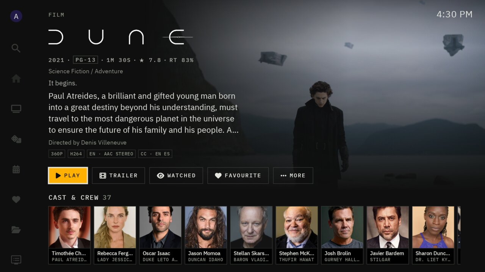
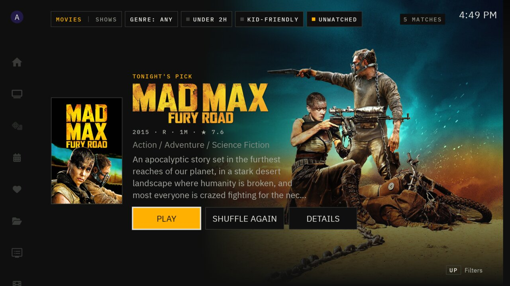

<p align="center"></p>

# Tally

**Tally is a Jellyfin client for Android TV.** It is a fork of the excellent
[Wholphin](https://github.com/damontecres/Wholphin) by damontecres: Wholphin's playback, library browsing and
settings are the foundation, and Tally adds a new look, live sports and a set of features for watching together
and deciding what to watch.

The name comes from the *tally light*, the red lamp on a broadcast camera that says "you're on air". The design
follows the same idea: a calm, dark control room with one accent color for what is focused or live.

> Tally is an independent fork. It is not made, reviewed or endorsed by the Wholphin project or by Jellyfin.
> Please report problems with Tally [here](https://github.com/Scdouglas1999/Tally/issues), not to Wholphin.

<p align="center">


</p>

## What Tally adds

**For everything you watch**
- **A new look.** Square, quiet and legible from the sofa: IBM Plex type, one amber accent, the whole app
  being redrawn in one style. Wholphin's own themes are still in Settings if you prefer them.
- **Surprise me.** One press picks tonight's film or show from your library, with quick filters (under two
  hours, kid-friendly, unwatched, genre).
- **Your year.** A look back at your year in watching: hours, films and episodes, most-watched shows, top
  genres, your busiest month, and which year your taste lives in.
- **Watch together.** Start or join a watch party (Jellyfin SyncPlay): everyone plays, pauses and skips
  together, each on their own TV.
- **Up next for films.** When a film in a collection ends, Tally offers the next one; otherwise "More like this".
- **Playing in the house.** See what is playing on the other screens in your home, and send what you are
  watching to another TV.
- **Sleep timer**, in the player's menu: after a number of minutes or when the current item ends.
- **Play on TV.** Start something on the TV from your phone's Jellyfin web page.

**Live sports** (needs the Tally server plugin, below)
- Today's games on the home screen and in their own section, with live scores, clocks and line scores.
- A score bug in the player, a box score one press away, and a switcher for the other games on now.
- Multiview: up to four games at once, sound following the one you focus. Or keep one game in a corner while
  you watch something else.
- Follow your teams so their games come first; hide scores when you are catching up later.
- A live-scores screensaver.

Everything else, from direct play and transcoding to subtitles, Seerr, profiles and ExoPlayer/MPV playback, is
Wholphin's. Its README describes those features in detail: <https://github.com/damontecres/Wholphin>.

## Install

Tally is not in an app store yet. On an Android TV, Google TV, Fire TV or Nvidia Shield:

1. Install the free **Downloader** app from your TV's app store.
2. In Downloader, enter the address of the newest APK:
   `https://github.com/Scdouglas1999/Tally/releases/latest/download/Tally.apk`
   (or the short link your server's owner gave you, see below).
3. Install it, then open Tally and sign in. Downloader can be deleted afterwards.

Tally installs next to Wholphin and the official Jellyfin app; it does not replace either. When a new version is
out, Tally offers to update itself on launch.

**If you run the server:** the Tally server plugin adds an install page to your Jellyfin server. It serves the APK
already set to your server's address, so your friends skip typing it, and lets them sign in from their phone with
Quick Connect.

## The server plugin

Live sports, the install page and Play on TV come from **Tally for Jellyfin**, a server plugin for Jellyfin 10.10
and 12. Without it, Tally is a complete Jellyfin client and simply hides the sports section. Plugin
downloads will be attached to Tally's [releases](https://github.com/Scdouglas1999/Tally/releases), starting with
the next one.

## Building

```sh
./gradlew :app:assembleDefaultDebug
```

Maintainer notes (how the fork is kept close to Wholphin, releases and signing) are in
[`jellytv/README.md`](jellytv/README.md) and the engineering rules in [`JELLYTV.md`](JELLYTV.md). Inside the code
the fork's working name, *JellyTV*, is still used for package and file names.

## Credits

Tally exists because of **[Wholphin](https://github.com/damontecres/Wholphin)**, written by
[damontecres](https://github.com/damontecres) and its contributors and translators. Its player, library,
settings and most of what makes Tally work are theirs. If you like Tally, please star Wholphin and consider
supporting its author.

Also thanks to [Jellyfin](https://jellyfin.org), the free software media system Tally connects to, and to the
projects Wholphin builds on.

## License

Tally is free software under the **GNU General Public License, version 2**, the same license as Wholphin: see
[LICENSE](LICENSE). [NOTICE.md](NOTICE.md) records that Tally is a modified version of Wholphin, where and when it
was changed, and the third-party material it includes (IBM Plex fonts under the SIL Open Font License).

Jellyfin is a trademark of the Jellyfin project. League and team names and logos belong to their owners; Tally is
not affiliated with any league, team or data provider.
